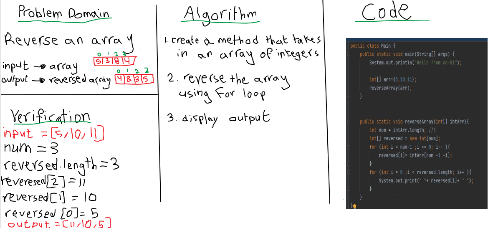

# Reverse an Array
This challenge require to create a function/method that takes in an array of integers and reverse it

## Whiteboard Process

## Approach & Efficiency
I used a simple way to solve this, a for loop. 
