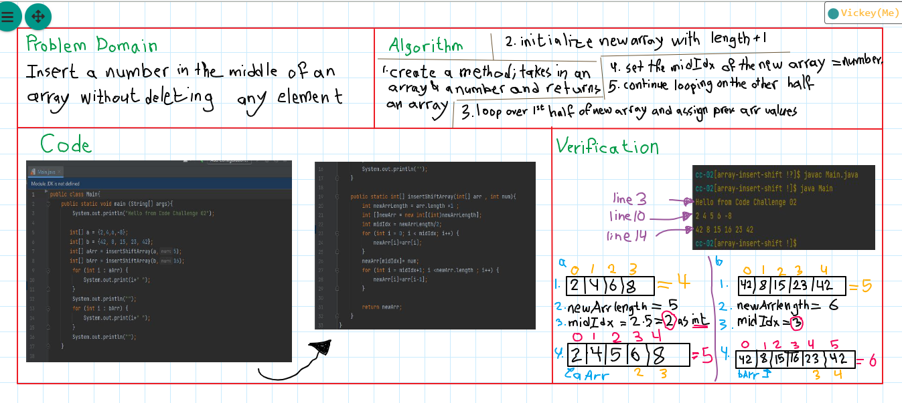

# Insert to Middle of an Array
Create a function that takes in an array and a number , add the number to the middle of the array and shift the other elements ( ***not*** replacing the middle element)

## Whiteboard Process

## Approach & Efficiency
Because we can't change the array's size in Java , I had to initialize a new array with the length of the original array +1;
I looped over the first half of the new array to assign the values, then I assigned the middle value(with the number taken in); and continued looping on the other half of the new array.