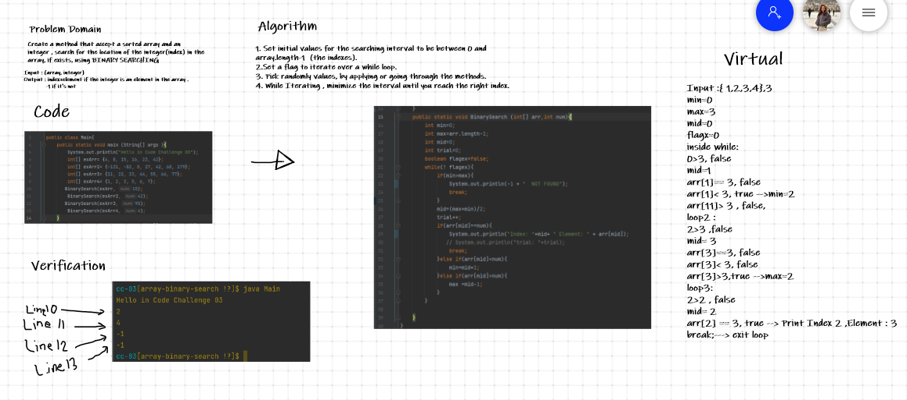

# Insert to Middle of an Array
 Create a method that does a binary search for the integer index in an array if the integer does exist.

## Whiteboard Process

## Approach & Efficiency
 I kind of used trial and error, in a computer language.