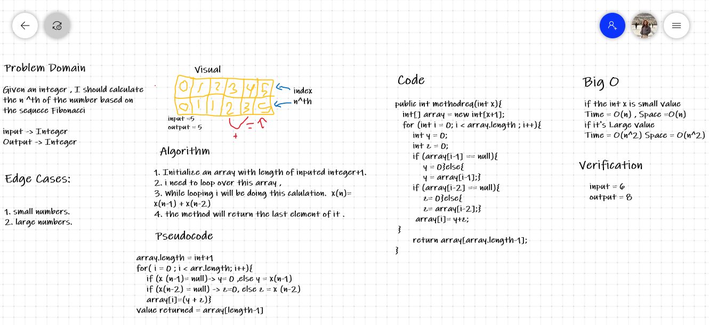

# Interview Practice

The first interviewer will ask this [question](https://codefellows.github.io/common_curriculum/data_structures_and_algorithms/Code_401/class-04/interview-01.html)
The second interviewer will ask this [question](https://codefellows.github.io/common_curriculum/data_structures_and_algorithms/Code_401/class-04/interview-02.html)

was the first Interviewer.

## Whiteboard Process

## Approach & Efficiency
 [Grading](https://drive.google.com/file/d/1C6oyDKEecDywocdnANwE7pc71VZ6Q96-/view?usp=sharing)