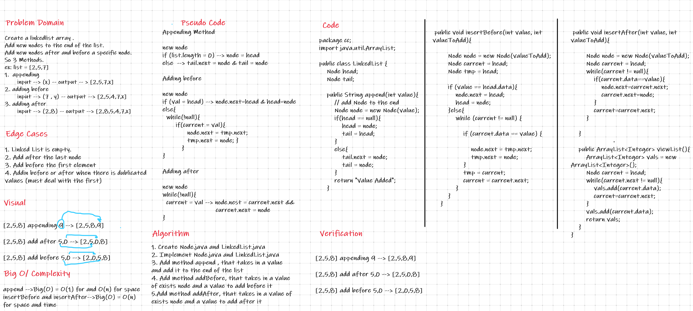

# Challenge Summary
In This challenge , add Node to the end of the LinkedList + add a node before and after a specific node(specified by value).

## Whiteboard Process

## Approach & Efficiency
I spent most of the time trying to solve the adding before and after specific node, I got stuck in the if condition for hours!
Big(O) space = O(n)
Big(O) time = O(n)

## Solution
append(value);
addAfter(value, valueToAdd);
addBefore(value,valueToAdd);