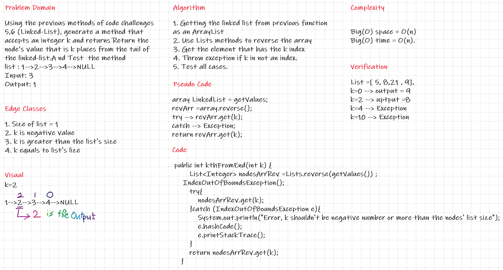

# Challenge Summary
Using the previous methods of code challenges (Linked-List), generate a method that accepts an integer k and returns Return the node’s value that is k places from the tail of the linked-list.

## Whiteboard Process

## Approach & Efficiency
I used the previous methods , and the Lists method(reverse), so k would be the index.
Big(O) space = O(n) -- Big(O) time = O(n).
 

## Solution

|Input 	                                |Arg k	|Output |
|---------------------------------------|-------|-------|
|head -> [1] -> [3] -> [8] -> [2] -> X	|0	|2 |
|head -> [1] -> [3] -> [8] -> [2] -> X	|2	|3 |
|head -> [1] -> [3] -> [8] -> [2] -> X	|6	|Exception |