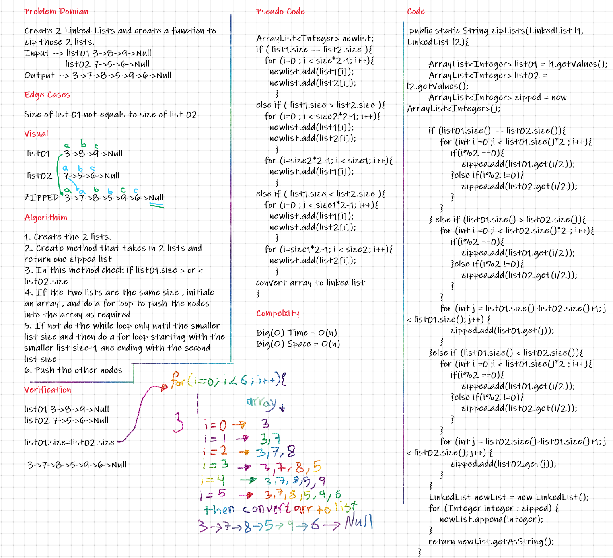

# Challenge Summary
Zip the two linked lists together into one so that the nodes alternate between the two lists and return a reference to the head of the zipped list.

## Whiteboard Process

## Approach & Efficiency
I converted the linked-lists into integers array to deal with them easily and when I got the zipped array I converted it to a linked-list
Big(O) Time = O(n)
Big(O) Space = O(n)

## Solution
Case-01 =>
list01: 3->8->9->Null
list02: 7->5->6->Null
zipped: 3->7->8->5->9->6->Null 

Case-02 =>
list01: 3->8->9->10->Null
list02: 7->5->6->Null
zipped: 3->7->8->5->9->6->10->Null