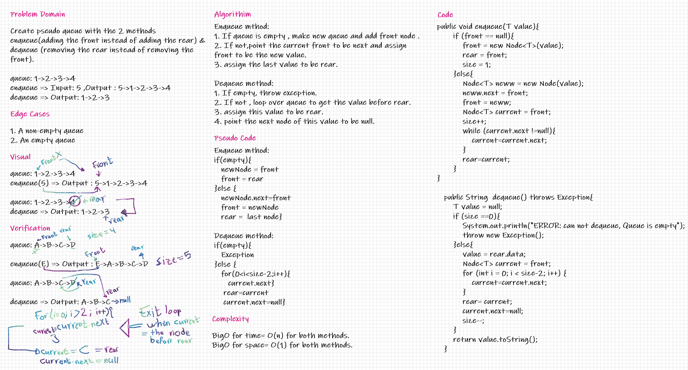

# Challenge Summary
Create pseudo queue with the 2 methods enqueue(adding the front instead of adding the rear) & dequeue (removing the rear instead of removing the front).

## Whiteboard Process

## Approach & Efficiency
BigO for time= O(n) for both methods.

BigO for space= O(1) for both methods.

I used same way when we solve s stack, but with rear i had to loop over the queue to get the last value

## Solution
queue: 1->2->3->4

enqueue => Input: 5 ,Output : 5->1->2->3->4

dequeue => Output: 1->2->3