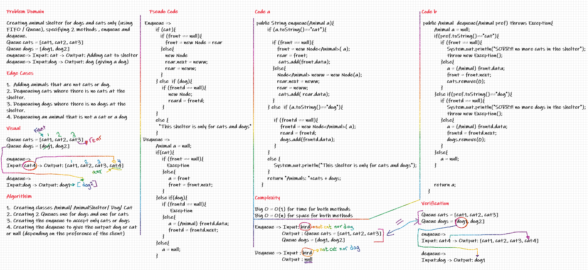

# Challenge Summary
Creating animal shelter for dogs and cats only (using FIFO / Queue), specifying 2 methods , enqueue and dequeue.

## Whiteboard Process

## Approach & Efficiency
I created 2 queues, one for cats and one for dogs , and worked as a normal queue.

Big O = O(1) for time for both methods

Big O = O(n) for space for both methods

## Solution
Example:

Queue cats = [cat1, cat2, cat3]

Queue dogs = [dog1, dog2]

enqueue=> Input: cat -> Output: Adding cat to shelter

dequeue=> Input:dog -> Output: dog (giving a dog)