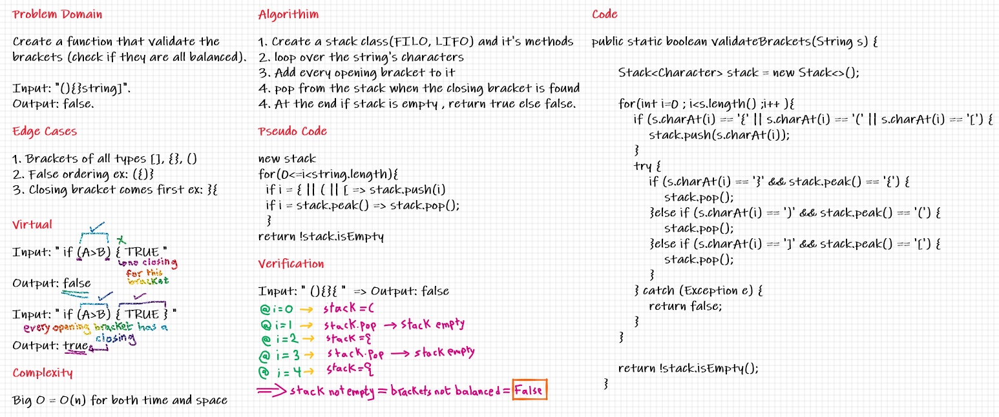

# Challenge Summary
Create a method that return true when brackets are used correctly, and return false when not; using stack.

## Whiteboard Process

## Approach & Efficiency
Using stack class, and it's method , I created a function that validate the brackets for a string(representing code)

Big O = O(n) for both time and space

## Solution
Input: " (){}{ "  => Output: false

Input: " (){}{} "  => Output: true

Input: " {([])} "  => Output: true

Input: " }(-) "  => Output: false
