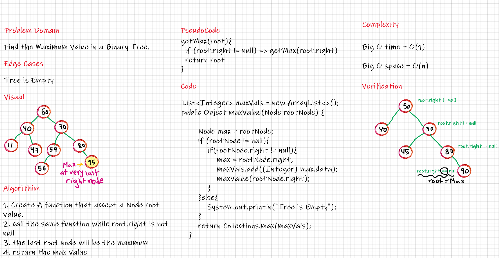

# Challenge Summary
Creating a function that find the maximum value in a Binary-Search-Tree

## Whiteboard Process

## Approach & Efficiency
Getting the right values until root.right is null.I used Lists and ArrayList to push all the max values and get the max value of them.

Big O time = O(1)

Big O space = O(n)

## Solution
ex. values of tree = 30, 70, 90, 80, 50, 55, 96 => Output = 96 .
