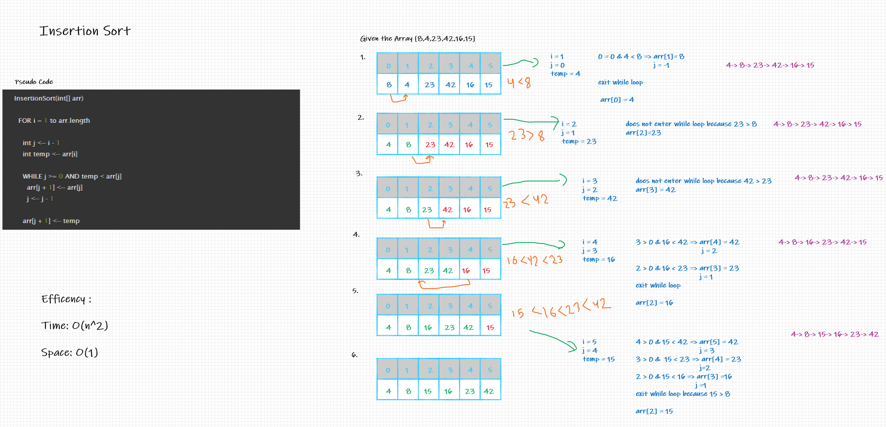

# blog-article

# Challenge Summary
sorting array with the idea that one element from the input elements is consumed in each iteration to find its correct position i.e, the position to which it belongs in a sorted array.

## Whiteboard Process

## Approach & Efficiency

Efficency :

Time: O(n^2)

Space: O(1)

Approach:

1. Iterate from arr[1] to arr[n] over the array.
2. Compare the current element (key) to its predecessor.
3. If the key element is smaller than its predecessor, compare it to the elements before. Move the greater elements one position up to make space for the swapped element.

## Solution
example:

input : [12, 11, 13, 5, 6]

output: [5, 6, 11, 12, 13]

**References:**
1. [Ref-1](https://www.hackerearth.com/practice/algorithms/sorting/insertion-sort/tutorial/)
2. [Ref-2](https://www.geeksforgeeks.org/insertion-sort/?fbclid=IwAR2VfMFt4nFiqvB0-dTN4YBWImf3qGsK7_iZk1lay3Di4SF8BhqfdBG7ePE)