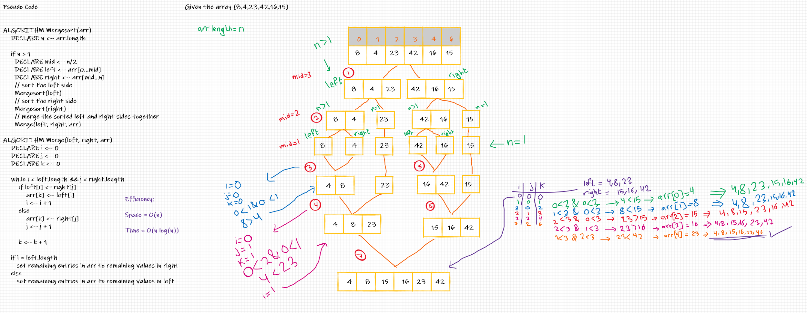

# Challenge Summary
Sorting an array by merge sort algorithim

## Whiteboard Process

## Approach & Efficiency
1. Divide array into 2 halves until the half size = 1.
2. Merging with sorting.

Efficiency:

Space = O(n)

Time = O(n log(n))

## Solution
ex.

