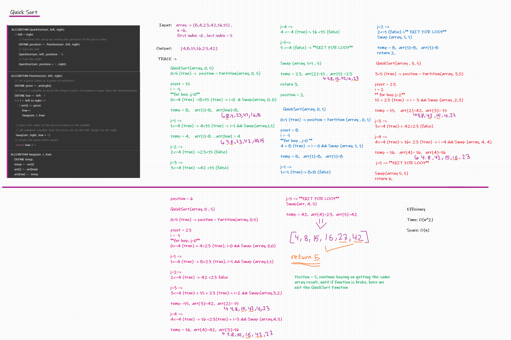

# Challenge Summary
Sorting an array by the quick sort algorithm.

Input: array of integers - Output: sorted array of integers

## Whiteboard Process

## Approach & Efficiency
Efficiency

Time: O(n^2)

Space: O(n)

Approach: QuickSort is a Divide and Conquer algorithm. It picks an element as pivot and partitions the given array around the picked pivot.

 There are many different versions of quickSort that pick pivot in different ways. 

1. Always pick first element as pivot.
2. Always pick last element as pivot (As in this BLOG)
3. Pick a random element as pivot.
4. Pick median as pivot.

## Solution
Input: [5,11,9,7,8] - Output: [5,7,8,9,11]
