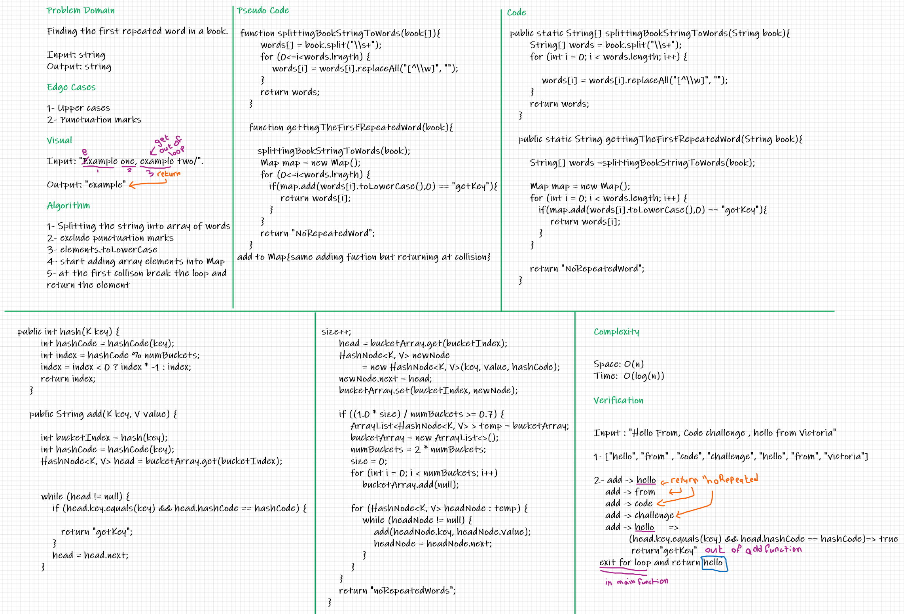

# Challenge Summary
Finding the first repeated word from a string, input: string - output: string.

## Whiteboard Process

## Approach & Efficiency
using add to hashmap function ->  find the first collision 

Space: O(n)

Time:  O(log(n))

## Solution

1. splitting the book string into words, with excluding punctuation marks using regex.
2. mapping thouth the array of words , and break the loop at the first collision.

**References:**
* [splitting string into array of words](https://stackoverflow.com/questions/4674850/converting-a-sentence-string-to-a-string-array-of-words-in-java)