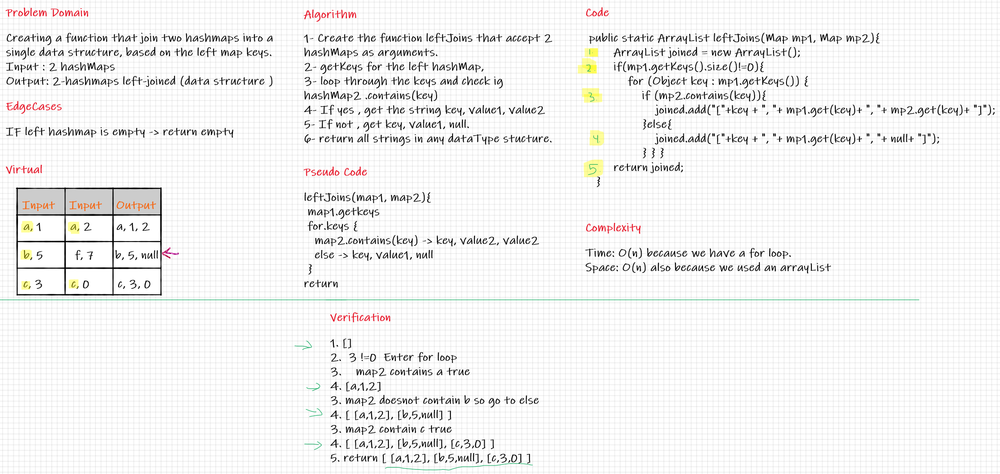

# Hashmap LEFT JOIN
Creating a function that join two hashmaps into a single data structure, based on the left map keys.

## Challenge
In order to do so , we have to implement a method that get me the key not hashed from table, and then loop over keys to check weather they match and join the hashMaps.

## Approach & Efficiency
getting the first hashmap keys , and check the second map if it contains the key, if yes , get( key + value of map1+ value of map 2).
if not, get (key+value of map1 + null).

Complexity:

Time: O(n) because we have a for loop.

Space: O(n) also because we used an arrayList

## Solution
