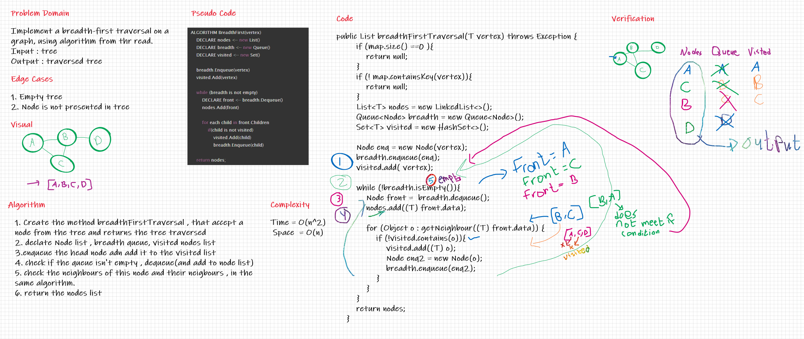
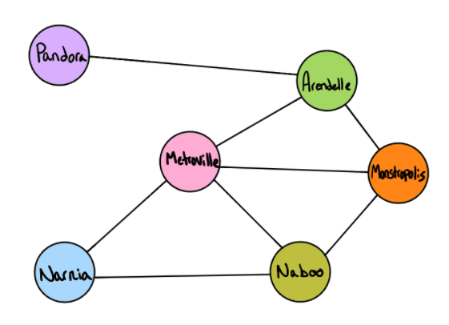

# Challenge Summary
Implement a breadth-first traversal on a graph, using algorithm from thr read.

## Whiteboard Process

## Approach & Efficiency

Complexity => Time = O(n^2) because I used for loop inside while loop  &  Space  = O(n) because we used Lists 

## Solution
ex=> 

Input :

Output:

Pandora, Arendelle, Metroville, Monstroplolis, Narnia, Naboo