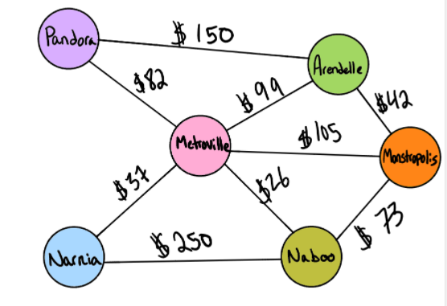

# Challenge Summary
Using Graph implement a method that takes in an array of destinations and return true with the price , if the trip is available, and return false with 0 price if trip is not available.

## Whiteboard Process
<!-- Embedded whiteboard image -->

## Approach & Efficiency

Complexity: 

Time = O(n) because it contains for loops & Space = O(n) because I used arrays.

## Solution
ex. 

Input => [Metroville, Pandora, ]	

Output => True, $82