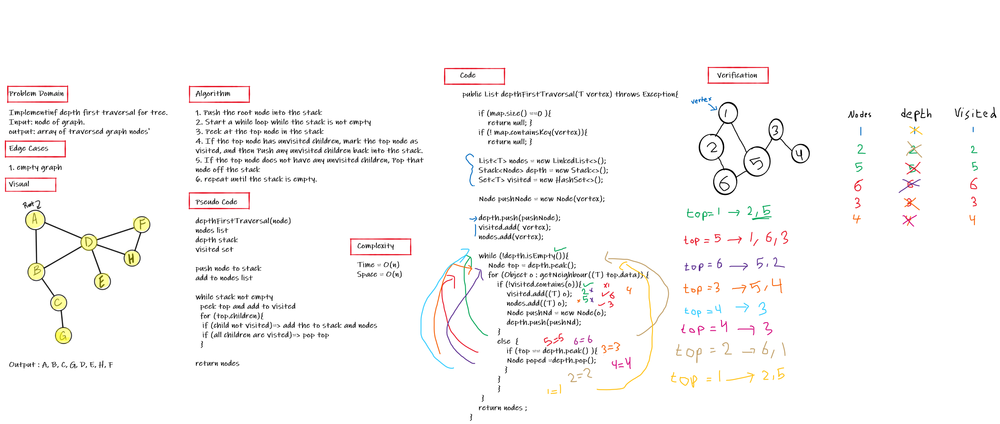

# Challenge Summary
Implement Depth first traversal for graph

## Whiteboard Process

## Approach & Efficiency
Using stack

Complexity=> 

Time = O(n) because I used a for loop 

Space = O(n) because I used stack and linkedList and arrayList.

## Solution
ex.

Input: 0 -> 1, 0 -> 2, 1 -> 2, 2 -> 0, 2 -> 3, 3 -> 3

Output:  1 2 0 3 